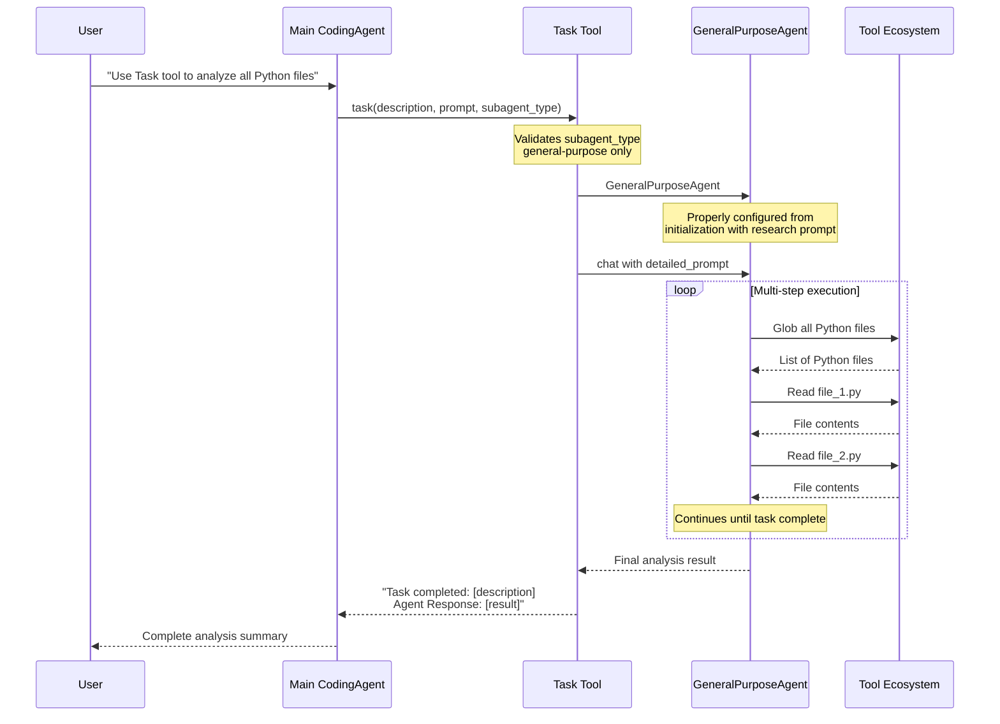
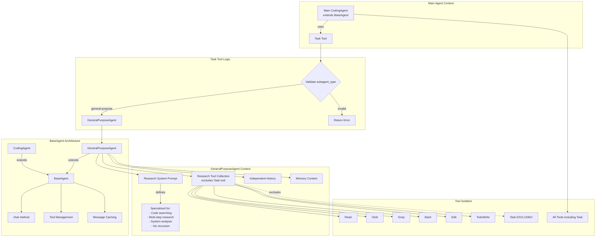
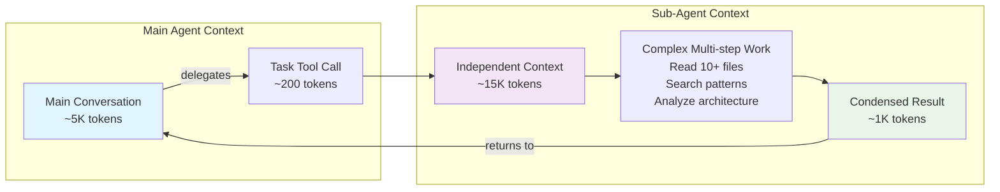
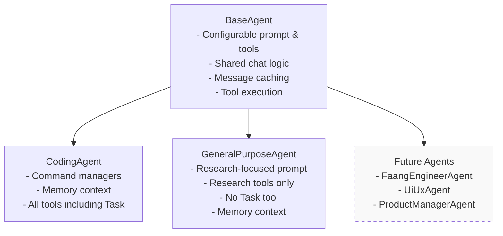

# Task Tool Multi-Agent Architecture

## Dynamic Agent System & Context Compression

The Task tool implements a **multi-agent delegation pattern** that enables the main coding agent to spawn specialized sub-agents for complex, autonomous work.

### Core Concept

The Task tool solves the **context compression problem** by:
1. Delegating complex multi-step tasks to independent agent instances
2. Running sub-agents in isolated contexts (separate conversation histories)
3. Returning only the final results to the main agent
4. Reducing context usage in the primary conversation

### Task Tool Flow Diagram



### Implementation Architecture



### Key Components

#### 1. Dynamic Task Tool Description (`coding_agent/tools/task_tool.py`)

**Key Innovation**: The Task tool description is **dynamically generated** based on available agents, not hardcoded.

**Current Implementation**:
```python
@tool("Task")
def task(description: str, prompt: str, subagent_type: str) -> str:
    """Launch a new agent to handle complex, multi-step tasks autonomously. 

Available agent types and the tools they have access to:
- general-purpose: General-purpose agent for researching complex questions, searching for code, and executing multi-step tasks. When you are searching for a keyword or file and are not confident that you will find the right match in the first few tries use this agent to perform the search for you. (Tools: *)
```

**How It Works**:
1. **Agent Registry**: Each agent defines its `whenToUse` description and capabilities
2. **Dynamic Description**: Task tool docstring is built from available agents 
3. **LLM Integration**: `bind_tools()` provides this description to the LLM as prompt engineering
4. **Automatic Usage**: LLM reads descriptions and knows when to use Task tool with specific agents

**Future Architecture** (Step 2+):
```python
# Agent registry system
AVAILABLE_AGENTS = {
    "general-purpose": {
        "whenToUse": "General-purpose agent for researching complex questions...",
        "tools": ["*"],
        "class": GeneralPurposeAgent
    },
    "faang-engineer-architect": {
        "whenToUse": "Use this agent when you need expert-level software engineering...",
        "tools": ["*"], 
        "class": FaangEngineerAgent
    }
}

def _generate_task_description():
    """Dynamically generate Task tool description from available agents."""
    agent_descriptions = []
    for agent_type, config in AVAILABLE_AGENTS.items():
        agent_descriptions.append(f"- {agent_type}: {config['whenToUse']} (Tools: {', '.join(config['tools'])})")
    
    return f"""Launch a new agent to handle complex, multi-step tasks autonomously.

Available agent types and the tools they have access to:
{chr(10).join(agent_descriptions)}

When using the Task tool, you must specify a subagent_type parameter to select which agent type to use.
"""

@tool("Task")
def task(description: str, prompt: str, subagent_type: str) -> str:
    # Dynamic docstring generation would happen at module load time
    task.__doc__ = _generate_task_description()
    
    # Validate subagent_type
    if subagent_type not in AVAILABLE_AGENTS:
        return f"Error: Unknown subagent_type '{subagent_type}'. Available types: {list(AVAILABLE_AGENTS.keys())}"
    
    try:
        # Create the specialized agent
        agent_config = AVAILABLE_AGENTS[subagent_type]
        agent = agent_config["class"]()
        
        # Execute the task
        result = agent.chat(prompt)
        
        # Return the complete result
        return f"Task completed: {description}\n\nAgent Response:\n{result}"
        
    except Exception as e:
        return f"Error executing task '{description}' with {subagent_type} agent: {str(e)}"
```

**Benefits**:
- **Scalable**: Adding new agents automatically updates Task tool description
- **Consistent**: Agent `whenToUse` descriptions stay synchronized
- **Maintainable**: Single source of truth for agent capabilities

#### 2. BaseAgent Architecture
```python
class BaseAgent:
    """Configurable agent base class."""
    
    def __init__(self, system_prompt: str, tools: List[BaseTool] = None, model_name: str = Config.MODEL_NAME):
        # Proper initialization sequence:
        self.system_prompt_str = system_prompt  # Set BEFORE tool binding
        self.tools = tools or self._get_default_tools()
        
        # Setup LLM and bind tools AFTER prompt is configured
        self.llm = ChatAnthropic(model=model_name, temperature=0.0, max_tokens=16384)
        self.tools_map, self.llm_with_tools = self._setup_tools()
        
        # Initialize with correct prompt from the start
        self.messages = [SystemMessage(content=self._create_cached_message(system_prompt))]
```

#### 3. GeneralPurposeAgent Implementation
```python
class GeneralPurposeAgent(BaseAgent):
    def __init__(self, model_name: str = Config.MODEL_NAME):
        # Load memory context (same as CodingAgent needs)
        self.memory_context = load_memory_context()
        
        super().__init__(
            system_prompt=self._get_general_purpose_prompt(),
            tools=self._get_research_tools(),  # Excludes Task tool
            model_name=model_name
        )
        
        # Add memory context if exists
        if self.memory_context and len(self.memory_context.strip()) > 100:
            self.messages.append(HumanMessage(content=self._create_cached_message(self.memory_context)))
    
    def _get_research_tools(self) -> List[BaseTool]:
        """Research tools (excludes Task tool to prevent infinite recursion)."""
        return [read_file, write_file, edit_file, run_command, list_files, 
                glob_files, grep_files, get_bash_output, todo_write]
```

#### 4. Architecture Benefits

**✅ Proper Initialization**: Each agent type gets the correct prompt from initialization  
**✅ Tool Isolation**: GeneralPurposeAgent excludes Task tool (prevents recursion)  
**✅ Extensible**: Easy to add new agent types with BaseAgent  
**✅ Clean Separation**: Base class handles common logic, subclasses define specialization  
**✅ Type Safety**: Each agent type is a distinct class with specific behavior

The specialized system prompt:
- Emphasizes research and analysis capabilities
- Provides specific guidelines for file searches and code exploration  
- Encourages thorough, multi-step investigation
- Requires final response with absolute file paths and code snippets

### Context Isolation Benefits



### Usage Patterns

#### 1. Code Analysis Tasks
```python
# Main agent delegates complex analysis
agent.chat('''Use the Task tool with:
- description: "analyze codebase"  
- prompt: "Search all Python files, understand architecture, identify main components"
- subagent_type: "general-purpose"
''')
```

#### 2. Multi-file Research
```python
# Research across multiple files without bloating main context
agent.chat('''Task tool: find all authentication-related code and security patterns
- description: "security audit"
- subagent_type: "general-purpose"  
''')
```

#### 3. Architecture Discovery
```python
# Deep codebase exploration
agent.chat('''Use Task tool to map the entire project structure and dependencies
- description: "map dependencies"
- subagent_type: "general-purpose"
''')
```

### BaseAgent Architecture (Step 1 Implementation)

The Task tool implementation uses a clean **BaseAgent architecture** that solves the fundamental initialization problem:

#### Problem Solved
The original approach tried to override system prompts **after** agent initialization:
```python
# ❌ FLAWED: Post-initialization override
agent = CodingAgent()  # Already bound with default prompt
agent.system_prompt_str = new_prompt  # Too late - LLM already configured
```

#### Solution: Configurable Base Class
```python
# ✅ CORRECT: Proper initialization sequence
class BaseAgent:
    def __init__(self, system_prompt: str, tools: List[BaseTool]):
        self.system_prompt_str = system_prompt  # Set FIRST
        self.llm = ChatAnthropic(...)           # Then setup LLM
        self.llm_with_tools = self.llm.bind_tools(tools)  # Bind with correct prompt
```

#### Class Hierarchy


### Current Limitations

1. **Single Agent Type**: Only "general-purpose" implemented
2. **No Concurrency**: Sequential execution only
3. **No State Sharing**: Sub-agents cannot communicate with each other
4. **Same Process**: No process isolation (planned for future)

### Future Extensions (Step 2+)

1. **Additional Agent Types**:
   - `faang-engineer-architect`: System design expertise
   - `ui-ux-designer`: Design and user experience
   - `product-manager`: Feature prioritization

2. **Concurrent Execution**: Multiple agents running in parallel

3. **Agent Registry**: Dynamic agent loading from `~/.claude/agents/`

4. **Process Isolation**: True sandboxing for agent execution

### Error Handling

The Task tool includes comprehensive error handling:

```python
try:
    # Create the specialized agent
    if subagent_type == "general-purpose":
        agent = create_general_purpose_agent()
    else:
        return f"Error: Unsupported agent type: {subagent_type}"
    
    # Execute the task
    result = agent.chat(prompt)
    
    # Return the complete result
    return f"Task completed: {description}\n\nAgent Response:\n{result}"
    
except Exception as e:
    return f"Error executing task '{description}' with {subagent_type} agent: {str(e)}"
```

### Integration Points

The Task tool integrates seamlessly with the existing architecture:

1. **Tool Registration**: Added to `coding_agent/tools/__init__.py`
2. **Agent Integration**: Imported in `coding_agent/core/agent.py`
3. **Circular Import Prevention**: Lazy imports in `task_tool.py`
4. **Caching Support**: Inherits ephemeral caching from main agent

This architecture enables **powerful context compression** while maintaining the familiar tool-based interaction pattern that users expect.