# Customized Agents System - Implementation Summary

## Overview

This document summarizes the experimental implementation of a dynamic agent system that allows loading custom agents from `~/.claude/agents/*.md` files at runtime. The system was developed and tested in `/Users/sonph36/dev/demo/sonph-code/coding_agent/experiments/`.

## Key Components

### 1. Agent Configuration Format (`agent_config_parser.py`)

**File Format**: `.md` files with YAML frontmatter
```yaml
---
name: agent-name
description: When to use this agent...
tools: Tool1, Tool2, Tool3  # optional, defaults to *
model: sonnet              # optional
color: blue               # optional
---

System prompt content here...
```

**Parser Features**:
- Primary YAML parser with `yaml.safe_load()`
- Fallback parser for complex multi-line descriptions that break YAML
- Handles agent files with example blocks containing XML-like content
- Validates required fields: `name`, `description`, system prompt content

### 2. Agent Registry (`agent_registry.py`)

**Singleton Pattern**: Caches discovered agents for performance
- Scans `~/.claude/agents/*.md` for user-defined agents
- Includes built-in agents (e.g., `general-purpose`)
- Provides agent list formatted for Task tool description
- Manages agent loading and caching

**Key Methods**:
- `get_available_agents()` - Returns all agents (built-in + user-defined)
- `get_agent_list_for_task_tool()` - Formats agents for Task tool docstring
- `load_agent(agent_type)` - Instantiates specific agent
- `clear_cache()` - Reloads agents from disk

### 3. Dynamic Agent (`dynamic_agent.py`)

**Tool Resolution**: Automatically filters available tools
- Scans `/Users/sonph36/dev/demo/sonph-code/coding_agent/tools/*.py`
- Uses regex `@tool\(["\']([^"\']+)["\']\)` to find tool names
- Filters out non-existent tools from agent configurations
- Skips MCP tools (`mcp__*`) as they won't be implemented soon
- Provides warnings for filtered tools

**Agent Creation**:
```python
agent = DynamicAgent.from_config(config)
# Creates agent with filtered tools and system prompt
```

### 4. Task Tool Generator (`task_tool_generator.py`)

**STATIC Description**: Generates Task tool docstring at APPLICATION STARTUP ONLY
- Scans all available agents once during startup
- Creates formatted description with examples  
- Sets STATIC Task tool description that never changes during runtime
- Critical for LLM caching - description must be frozen after startup

## Test Results

**Full System Test** (`full_system_test.py`):
- ✅ Parser: 5/5 agent files parsed successfully
- ✅ Task Tool Generation: Dynamic description with all 6 agents (8,678 chars)
- ✅ Mock Task Execution: Tool filtering and agent loading work
- ✅ Agent Discovery: 1 built-in + 5 user-defined agents

**Tool Filtering Example**:
- Original: 13 tools for ui-ux-designer
- Filtered out: `{'NotebookRead', 'WebFetch', 'WebSearch', 'ExitPlanMode'}`
- Skipped MCP: `{'mcp__ide__getDiagnostics', 'mcp__ide__executeCode'}`  
- Final: 7 valid tools

## Current Agent Files

Successfully parsed from `~/.claude/agents/`:
1. `cpo-strategic-advisor.md` (2,961 chars)
2. `product-manager-faang-startup.md` (2,237 chars)
3. `faang-engineer-architect.md` (2,690 chars)
4. `ui-ux-designer.md` (2,568 chars)
5. `octalysis-gamification-expert.md` (2,514 chars)

## JSON Conversion

Created JSON versions for documentation:
- `/Users/sonph36/dev/demo/sonph-code/docs/agents/ui-ux-designer.json`
- `/Users/sonph36/dev/demo/sonph-code/docs/agents/octalysis-gamification-expert.json`

## Implementation Path

### Phase 1: Integration (Required)
1. **Move experimental code to main codebase**:
   - `agent_config_parser.py` → `coding_agent/core/`
   - `agent_registry.py` → `coding_agent/core/`
   - `dynamic_agent.py` → `coding_agent/core/`

2. **Update Task tool** (`coding_agent/tools/task_tool.py`):
   - Import `AgentRegistry` and `generate_task_description()`
   - Generate STATIC docstring at application startup
   - Set Task tool description ONCE and freeze it for entire application lifetime
   - NEVER call `registry.get_agent_list_for_task_tool()` during runtime

3. **Integrate with BaseAgent**:
   - Make `DynamicAgent` inherit from `BaseAgent`
   - Implement actual tool loading (not just mock)
   - Connect to LLM and tool execution system

### Phase 2: Production Features
1. **Error Handling**:
   - Graceful fallbacks for malformed agent files
   - User-friendly error messages
   - Agent validation on load

2. **Performance Optimization**:
   - Cache tool scanning results
   - Lazy loading of agents
   - Background agent discovery

3. **Advanced Features**:
   - Agent hot-reloading
   - Agent versioning
   - Custom tool sets per agent

## Critical Implementation Notes

1. **Tool Filtering is Essential**: The `_resolve_tools()` method must scan actual tools directory, not use hardcoded lists
2. **MCP Tools**: Skip all `mcp__*` tools as they won't be implemented soon
3. **STATIC Task Tool**: The Task tool docstring MUST be generated ONCE at startup and FROZEN for entire application lifetime (LLM caching requirement)
4. **Fallback Parser**: Complex YAML with examples requires fallback parsing
5. **Singleton Registry**: Use singleton pattern for performance and consistency
6. **No Runtime Changes**: Agent discovery and Task tool description generation must happen at startup only

## File Structure After Integration

```
coding_agent/
├── core/
│   ├── agent_config_parser.py  # NEW
│   ├── agent_registry.py       # NEW  
│   ├── dynamic_agent.py        # NEW
│   └── ...existing files
├── tools/
│   ├── task_tool.py            # MODIFY: dynamic docstring
│   └── ...existing tools
└── ...
```

## Testing Strategy

Before production deployment:
1. Run full system tests with real agent files
2. Test tool filtering with various configurations  
3. Verify Task tool description generation
4. Test error handling with malformed files
5. Performance test with multiple agents

## Flow Diagrams

### System Initialization Flow (STARTUP ONLY - STATIC)


### Runtime Agent Loading Flow (USER REQUEST)


### File Structure and Data Flow (CORRECTED)

```mermaid
flowchart TD
    subgraph STARTUP["🚀 APPLICATION STARTUP - ONCE ONLY"]
        A["~/.claude/agents/*.md"] -->|scan| B[AgentRegistry]
        C["coding_agent/tools/*.py"] -->|"scan @tool"| D[Tool Scanner]
        
        B --> E[Agent Configs CACHED]
        D --> F[Available Tools CACHED]
        
        B -->|get_agent_list| K[STATIC Task Description]
        K --> J[Task Tool FROZEN]
    end
    
    subgraph RUNTIME["⚡ USER REQUEST - RUNTIME"]
        L[User Request] --> J
        J --> G["DynamicAgent.from_config()"]
        E --> G
        F --> G
        
        G --> H[Filtered Agent]
        H -->|"tools: 7/13"| I[Runtime Agent]
        I --> M[Agent Response]
    end
    
    style A fill:#e1f5fe
    style C fill:#e1f5fe
    style E fill:#fff3e0
    style F fill:#fff3e0
    style K fill:#ffcdd2
    style J fill:#ffcdd2
    style H fill:#c8e6c9
    style I fill:#c8e6c9
    style M fill:#ffecb3
```



### Component Architecture


## Key Benefits

1. **Extensible**: New agents can be added without code changes
2. **Robust**: Automatic tool filtering prevents runtime errors
3. **Dynamic**: Task tool always reflects current agent availability
4. **Maintainable**: Clear separation between configuration and code
5. **User-Friendly**: Simple markdown format for agent definitions

---

**Status**: Experimental implementation complete and tested. Ready for integration into main codebase when needed.

# Reminder for SonPH
- Test with result (generate a game)
- Test using Proxyman to eyeball the: Task tool description, and how agent work - use my codes not claude-code yet -> need to "track" sonph-code agent with Proxyman